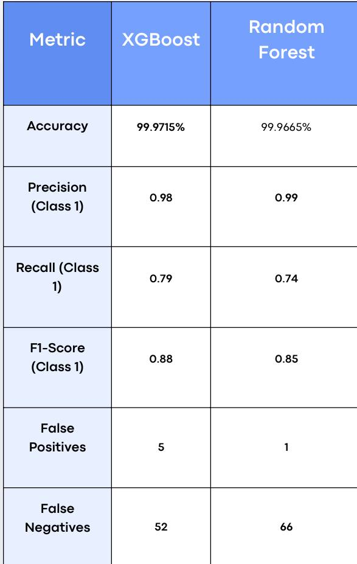

###Madrak | مدرك

###About the Project

Madrak is a machine learning project designed to detect fraudulent bank card transactions. The model analyzes transaction patterns and classifies transactions as either legitimate or fraudulent.

###Project Objective

The main goal of Madrak is to use machine learning to identify potentially fraudulent transactions and help improve the detection of financial fraud.

###Dataset

The project uses the PaySim dataset, which contains simulated financial transaction data. The dataset was cleaned and preprocessed before training the machine learning model.

Due to the dataset’s large file size, it is not included in this repository. The dataset can be downloaded from its original source and placed in the project directory before running the notebook.

###Project Workflow
 • Data exploration and understanding
 • Data cleaning and preprocessing
 • Feature selection
 • Handling class imbalance
 • Training the machine learning model
 • Evaluating model performance
 • Predicting fraudulent transactions
 
## Model Comparison

### Summary
XGBoost achieved slightly higher accuracy, recall, and F1-score, while Random Forest had higher precision and fewer false positives.

###Technologies
 • Python
 • Pandas
 • NumPy
 • Matplotlib
 • Scikit-learn
 • Jupyter Notebook

###Project Files
 • Madrak.ipynb — Jupyter Notebook containing the complete project workflow.
 • dataset.csv — Dataset used for training and evaluation.

###Results
The model was evaluated using appropriate classification metrics to measure its ability to distinguish between legitimate and fraudulent transactions
